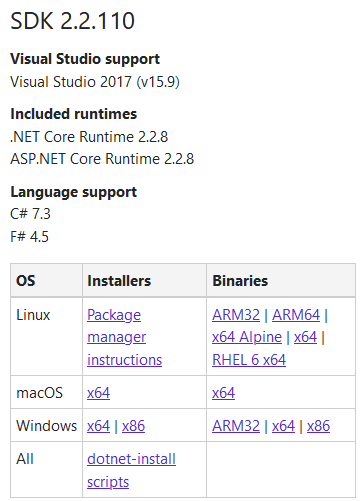
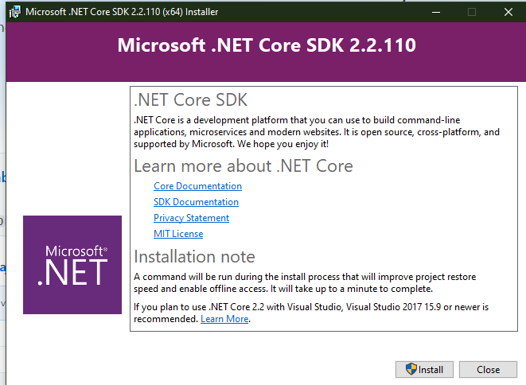
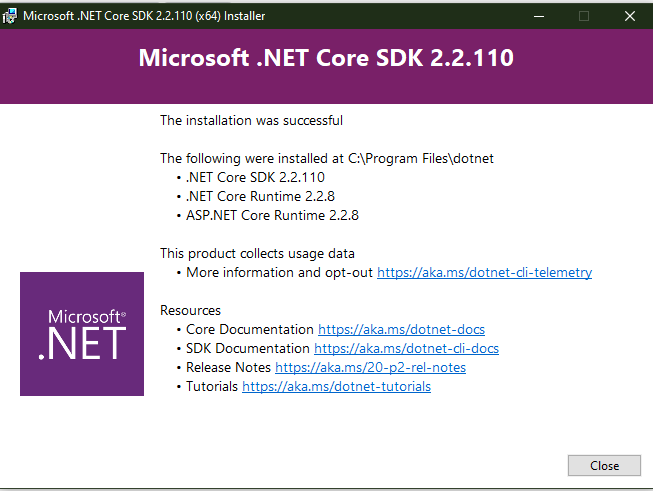
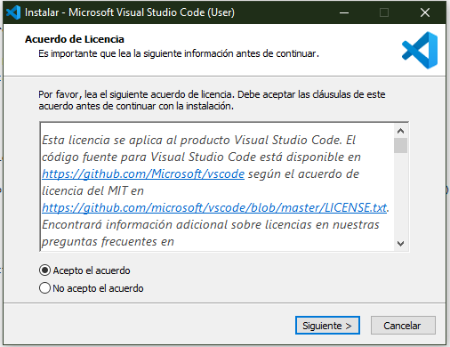
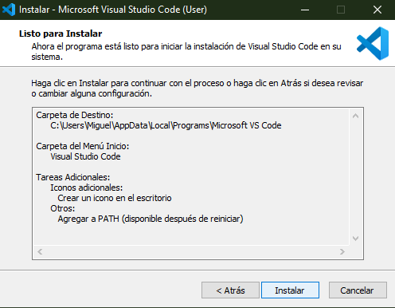
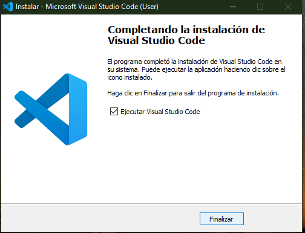
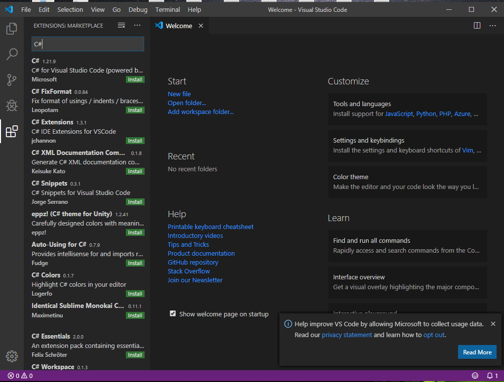

# Ejercicio de Markdown

# Instalación de dotnet core 2.2

Lo primero que tenemos que hacer
es bajar el archivo de instalación del siguiente [link](https://dotnet.microsoft.com/download/dotnet-core/2.2) dependiendo de nuestra computadora, en mi caso, elegiré la versión de 64 bits.

Ejecutamos el archivo de instalación e instalamos Dotnet core 2.2

Listo, se ha instalado dotnet core 2.2 en la computadora, se da click en cerrar para finalizar la instalación.

# Instalación y configuración de Visual Studio Code para C#

Para instalar Visual Studio Code tenemos que ir al siguiente [link](https://code.visualstudio.com/) y descargar el archivo 

Una vez descargado, lo siguiente es instalarlo. Para eso, abrimos el archivo descargado y damos en "Aceptar" a todo 

Ahora, se procede a instalar Visual Studio Code

y "Finalizar".

Lo siguiente es configurar para C#, para esto, descargamos la extensión de C# dentro de visual studio code.

# Instalación de git, conectado a tu cuenta de GitHub y VSC

