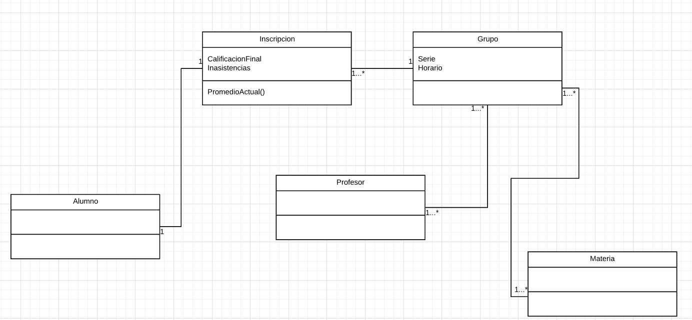
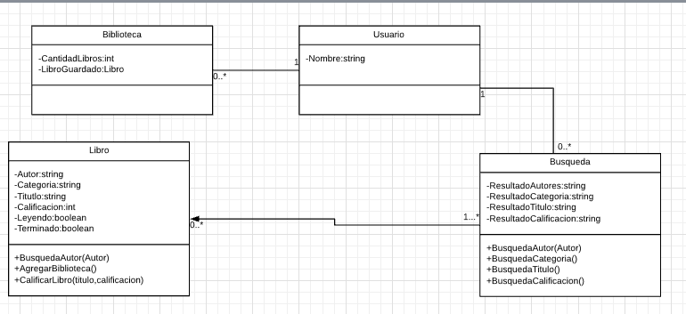

ACTIVIDADES

1. Agrega la cardinalidad o multiplicidad para las asociaciones del siguiente diagrama de clases, justifica tus decisiones:

Justificación: 

Relación Alumno-inscripcion
Para ser llamado alumno, tiene que estar inscrito, lo cual solo se puede realizar una vez.
Cada alumno tiene solamente una inscripcion.
De la misma manera, un objeto inscripción solo existe para un objeto alumno

Relacion Inscripcion-Grupo
A cada alumno inscrito, solo se le asigna un grupo
En cada grupo pueden existir desde 1 hasta varios alumnos.

Relación Grupo-Profesor
Cada grupo puede tener desde 1 profesor hasta varios, depende su número de materias
Para ser llamado profesor tiene que impartir clases desde 1 hasta varios grupos.

Relación Grupo-Materia
Cada grupo tiene desde 1 hasta varias materias, pues un grupo sin materias no tendría caso.
Cada materia por el hecho de existir debe ser entonces dada a 1 o más grupos

2. Completa los tipos de asociación (Agregación y Composición) y multiplicidad que hay entre las clases siguientes y explica porque es de ese tipo.

Justificación:
La asociación entre la clase librero y libro, siendo librero la clase TODO y la clase libro la PARTE, es de agregación pues la existencia de un libro no depende de la existencia de un librero, 
Al suprimir a la clase librero, la clase libro puede seguir existiendo.

Lo asociación entre la clase libro y capitulos es de composición, siendo la clase libro el TODO y la clase capitulos la PARTE, pues un capitulo solo existe si esta dentro de un libro.
La supresión del libro indica por consecuencia la eliminación del capitulo dentro de ese libro.

3. Haz el diagrama de clases del siguiente sistema:

Nos piden hacer una aplicación para llevar una bitácora de los libros
que estamos leyendo y aquellos que ya hemos terminado de leer. 
En la App podemos buscar libros por autor, categoría, título y calificación.
Una vez que encontramos un libro, podemos agregarlo a nuestra biblioteca e indicar
si lo estamos leyendo o ya terminamos de leer y lo podemos poner una calificación.
Los libros pueden tener más de un autor, si buscamos un autor podemos ver la
lista de los libros que ha escrito. En caso de que haya traducciones o reediciones 
se consideran como el mismo libro. 

OPCIONAL: Podemos indicar si un libro se lo prestamos a un amigo, desde que fecha y
tenemos su correo para recordarle que nos lo regrese.

DIAGRAMA DE CLASES: 
